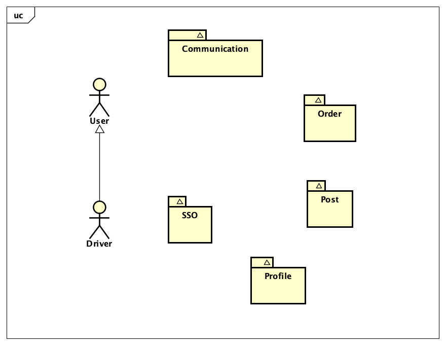
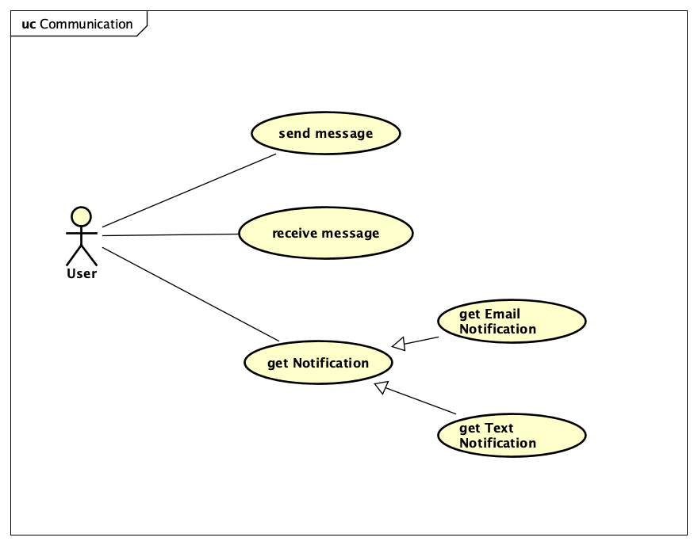
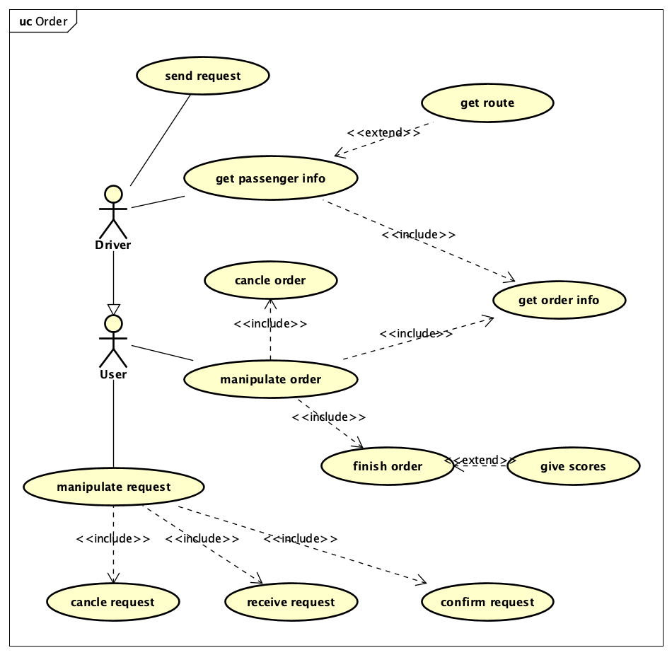
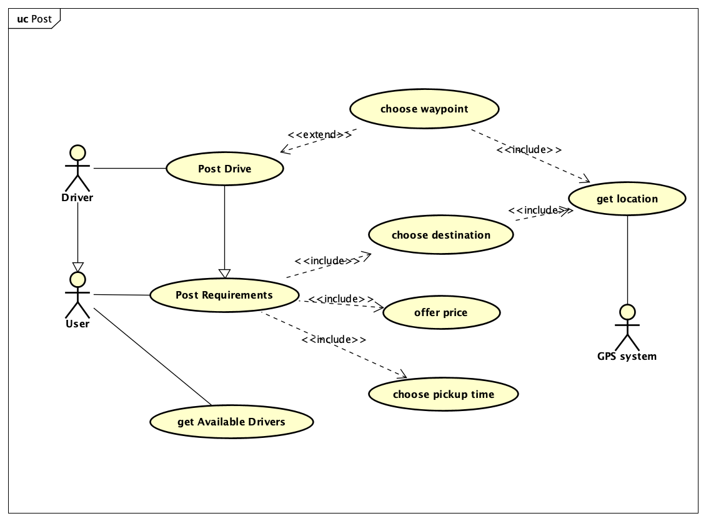
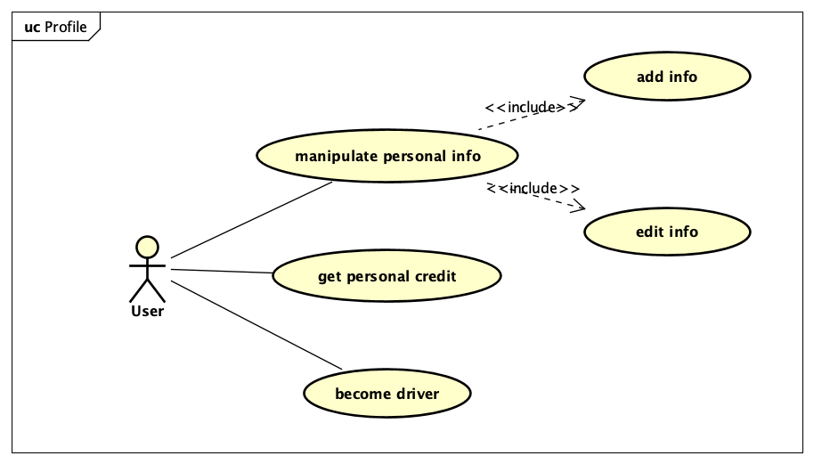
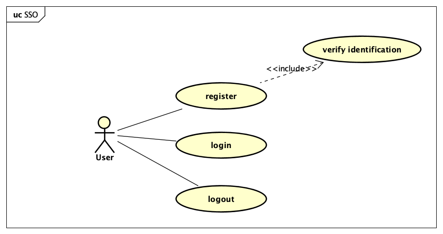

# RideNShare

RideNShare is a Web Application proposed to help Virginia Tech Students and staffs to share and get a ride.

## Team info

We are Master of Engineering students majoring in computer science at Virginia Tech.

## Technologies

| Technologies | Description |
| ------------ | ----------- |
|              |             |
|              |             |
|              |             |
|              |             |
|              |             |
|              |             |

## Design

### Use case 

UML 工具 - Astah uml

**package diagram**

**communication**

**order**

**post**

**profile**

**sso**

### Front end design

Tools: **Figma**

### Database Design

## 难点记录

### 登录认证

CAS(central authentication service)

[CAS 原理](https://djangocas.dev/blog/cas-101-introduction-to-cas-central-authentication-service/#cas-introduction)

[gituhub](https://github.com/apereo/java-cas-client)

我的设计思路：as provided below:

- api: app/acounts/login
- Redirect to -- CAS server
- CAS login at login form - validate
- success - new page 200 OK

### 部署方式

尝试了好几种方法：

方法1: 我的老方法 - EC2 as server, Docker来管理并使用各个服务。Nginx反向代理。（麻烦！）

方法2: AWS Amplify 部署前端页面 --  待解决（看起来可行，但是遇到了问题，我只会在这里部署前端，后端怎样都无法识别）

方法3： AWS S3 托管静态页面 + Elastic BeanStalk来部署后端api - 难点- 跨域问题待解局 - 但是看起来可行。

[Elastic Beanstalk 部署Springboot 程序以及跨域问题的解决方案](https://blog.csdn.net/danpob13624/article/details/106778329)

