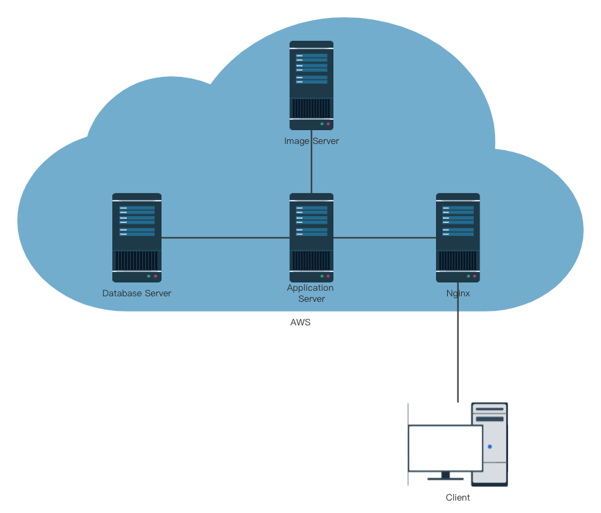

# RideNShare

Demo [link](https://ridenshare.s3.amazonaws.com/image/12-5-1080p.mp4) (https://ridenshare.s3.amazonaws.com/image/12-5-1080p.mp4)

RideNShare is a Web Application proposed to help Virginia Tech Students and staffs to share and get a ride.

We have developed a website for VT faculties and students, called RideNShare. Users can offer a ride or get a ride using our product. 

Our product solves some safety problems of traditional ride apps. All users who use our products need a VT email to register to ensure that users are our students or faculties. Besides this, users can make some money by offering rides for someone in need, and users who do not have a car can get help in need. Last but not least, sharing a ride is both economical and environmentally-friendly, improving the utilization of vehicles and reducing road congestion.

## Team info

We are Master of Engineering students majoring in computer science at Virginia Tech.

## Technologies

|                    | Technologies                                                 |
| ------------------ | ------------------------------------------------------------ |
| **Frontend**       | Vue.js, ElementUI, HTML, CSS, Typescript, js, Session, Cookie |
| **Database**       | AWS RDS (MySQL)                                              |
| **Backend**        | Java, Springboot, Node.js, Mybatis                           |
| **Tools&Platform** | Design Phrase: **Figma**                                     |
|                    | UML Tools: Astah UML                                         |
|                    | Version control: Gitlab                                      |
|                    | Project management: **Jira**                                 |
|                    | Deployment: AWS. **AWS S3** as image Server, **AWS RDS** as database, **AWS EC2** as server. **Nginx** as proxy server for request balancing |

## Architecture

****

Our system is deployed on the **AWS platform.** We use the **AWS RDS** as our database server. And we choose **MySQL as our database**. In order to relieve the pressure of the database server, we use the **AWS S3 server** to store all the static resources. In order to balance the request, **Nginx** is used here as a Proxy server to balance the requests.

## Design

### Use case 

UML 工具 - Astah uml

**package diagram**

**communication**

**order**

**post**

**profile**

**sso**

### Front end design

Tools: **Figma**

### Database Design

## 难点记录

使用的东西和我的blog demo差不多，具体详细见[here](https://github.com/Chengp1997/myBlogDemo)

这里记录没有用过的东西。

### 登录认证

intended to use CAS, but did not have time for this. Record here for further use.

CAS(central authentication service)

[CAS 原理](https://djangocas.dev/blog/cas-101-introduction-to-cas-central-authentication-service/#cas-introduction)

[gituhub](https://github.com/apereo/java-cas-client)

我的设计思路：as provided below:

- api: app/acounts/login
- Redirect to -- CAS server
- CAS login at login form - validate
- success - new page 200 OK

### Session 问题

**Session Technology:** We used the session to store the user’s information. But when we deployed on cloud, a problem occurred because the session is stored in the server side and there are many servers provided by AWS service, this will result in cookie loss. In this case, **Spring session** technology is used to solve the problem, all the sessions are stored in the database, and all the servers can share the session data. 

### 部署方式

尝试了好几种方法：

方法1: 我的老方法 - EC2 as server, Docker来管理并使用各个服务。Nginx反向代理。（麻烦！）

方法2: AWS Amplify 部署前端页面 --  待解决（看起来可行，但是遇到了问题，我只会在这里部署前端，后端怎样都无法识别）

方法3： AWS S3 托管静态页面 + Elastic BeanStalk来部署后端api - 难点- 跨域问题待解局 - 但是看起来可行。

[Elastic Beanstalk 部署Springboot 程序以及跨域问题的解决方案](https://blog.csdn.net/danpob13624/article/details/106778329)

## Future

In the future, we will optimize the project by adding some attractive features like online payments, driving-route mapping and demonstration, etc. Besides, Caching will be introduced into our project to store the value between client and server. We decided to use Redis with AWS, Ngnix to support this problem. Machine learning is also an optimization way to enhance our functionality. Such as using machine learning to drive-route mapping to find a passenger a faster driver. Apart from that, an administration subsystem can be added to provide better support to the users. For us, with the experience of Jira project management, we will be able to assign tasks more reasonably. Besides, deployment could be more efficient, as factors that may influence the code will be considered in advance. 

